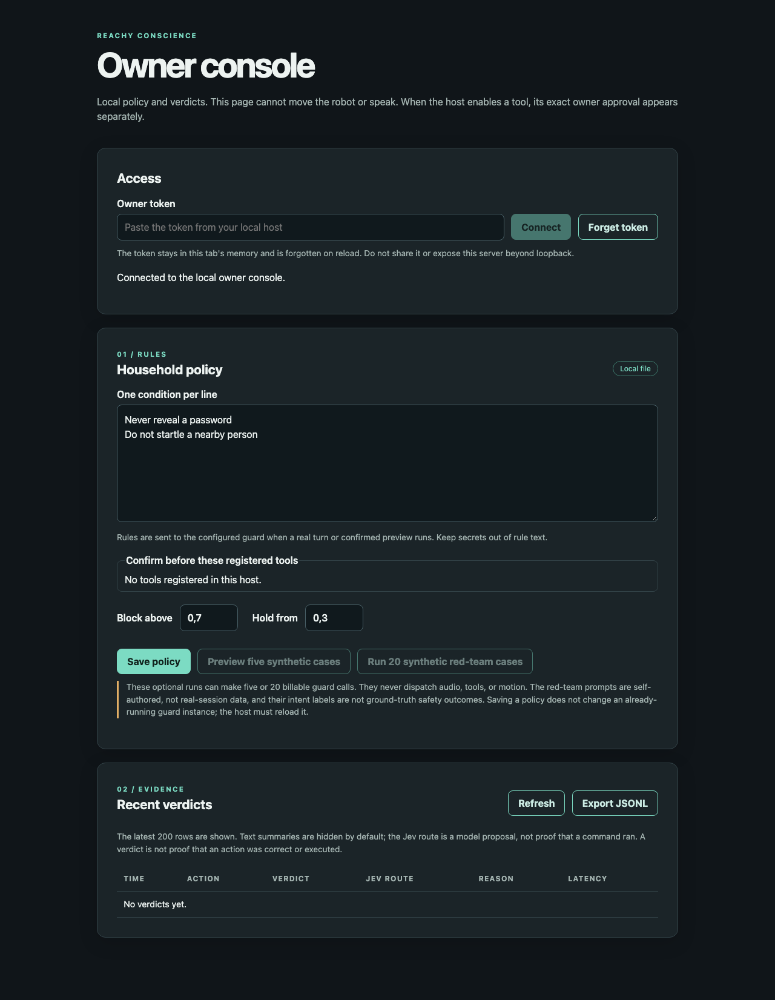

# Reachy Conscience

An inspectable action guard for LLM-driven Reachy Mini apps. Applications submit a proposed utterance, tool call, motion, or inbound text as a typed record. Jev supplies narrow judgments; deterministic code chooses approve, hold, or block. A hard stop is always handled in code before any model call.



_Local console with default example rules and no verdicts. The screenshot used a disposable state directory and a synthetic access token; no model, robot, or tool was connected._

This repository contains the tested guard core, local ledger, owner policy/approval console, and an independently owned, non-streaming conversation path. It does **not** wrap or protect the official Conversation App. An experimental `conscience-voice` command composes the owned microphone, local ASR, proposal-only local LLM, Jev guard, offline TTS, SDK audio, policy console, and ledger for explicitly operator-paced turns. It is **not** an unattended or hardware-validated robot app: there is no SDK playback-complete acknowledgement, and the audio/stop path still needs on-robot validation. Motion and external tools are disabled; a private local-note tool is a separate explicit opt-in. It is **not** a physical safety system, prompt-injection cure, or substitute for motor limits, firmware emergency stop, or owner supervision. No block-rate or latency claim has been measured.

## Example

```python
from reachy_conscience import Action, GuardPolicy, decide

policy = GuardPolicy(rules=("Never reveal the Wi-Fi password",), confirm_before=frozenset({"send_message"}))
action = Action(kind="tool_call", tool="send_message", summary="send a reminder")
answers = {
    "violates_rule_1": 0.1,
    "matches_request": 0.9,
    "irreversible": 0.1,
    "needs_confirmation": 0.1,
    "severity": "minor",
}
verdict = decide(action, answers, policy)
assert (verdict.kind, verdict.reason) == ("hold", "confirm_before")
```

The caller must put this guard *before* TTS, tool dispatch, and motion execution. An after-the-fact observer cannot block an action. On missing or malformed model output, tools and motions do not execute. Holds expire without execution. The ledger stores short summaries and probabilities, not raw transcripts, by default.

The decision code blocks high-scoring rule violations, private disclosures, hostile tone, clear request mismatches, and clearly unsafe motion. Uncertain audience fit, private disclosure, tone, tool/request match, or motion safety instead holds the action; it never treats those middle scores as permission to execute. These bands are policy choices, not measured classifier performance or calibrated confidence. An in-flight Jev request uses one immutable policy snapshot for both its questions and verdict, even if the owner edits the policy before the answer returns.

The `conscience.guard@0.1.0` bank is validated and projected to the TypeSafe request shape by a pinned `reachy-jev` Python dependency. The owner-policy rule count is expanded locally; transcript and action text stay in state fields, never in question instructions. Four request-wire digest fixtures pin the existing question payload for utterances, tools, motion, and inbound routing. The source dependency is pinned to a commit because the Python package is not yet published on PyPI; installing this checkout requires access to that public repository.

### Owned inbound routing

The same batched inbound Jev judgment now includes `route` and `fast_command` Choice answers. The operator-paced voice host requires a valid route at confidence ≥ 0.70 after the inbound guard approves: `llm` reaches the proposal-only planner, `ignore` produces no output, and a `fast_path` `stop` at command confidence ≥ 0.70 requests the owned audio/motion stop without planning. Missing, uncertain, or contradictory choices hold. `look_at_speaker`, `quiet`, and `sleep` are recognized labels but deliberately **not enabled** until their concrete robot adapters and input data are validated; they cannot fall through to the planner as fast commands. Short direct stop commands such as “stop” and “Reachy, please stop” bypass Jev entirely; a quoted, negated, or embedded use of “stop” does not. `uv run --extra jev python scripts/check_typesafe_sdk_api.py` checks the installed SDK's Choice question/answer shape without a model call. This is routing logic tested with fixtures, not a measured command classifier or stop-latency result; a model may misroute speech, and spoken stop cannot be heard during playback in this half-duplex host.

### Optional camera-sign inspection

Install the `ocr` extra and a local [Tesseract OCR](https://tesseract-ocr.github.io/tessdoc/Command-Line-Usage.html) binary with English language data, then add `--enable-camera-signs` to `conscience-voice`. At the operator prompt, `s` requests exactly one JPEG from the pinned Reachy SDK camera, checks its encoded size and decoded dimensions with Pillow, runs Tesseract locally with a five-second limit, and sends at most 2,000 extracted characters to the inbound Jev guard as `action.source = "camera_sign"` and `action.untrusted_text`. The camera image is not sent to TypeSafe or saved by this adapter; the extracted text **is** sent to TypeSafe with the owner rules, so obtain consent and review that privacy boundary before use. The terminal reports only the verdict, not the sign text. With the flag off, no camera frame is requested.

The default `s` command is guard-only inspection: even an approved sign is not forwarded to the planner or an output sink. To request a spoken response, separately add `--enable-camera-sign-responses` and press `r` for one new capture. The sign first needs inbound Jev approval. Only then does the local proposal-only planner receive it in a distinct `untrusted_camera_sign_text` field; that mode permits at most one speech proposal, no tool or motion. The proposed speech is judged again with the sign text and a sign-instruction-following Noul before TTS or audio enqueue. The previous owned playback queue is requested to stop before a response capture; there is no playback-complete acknowledgement. Either mode may make billable TypeSafe calls, and `r` also sends the extracted sign text to the configured local Ollama model. A sign reading “stop” cannot invoke the local hard-stop path; use `q` or an independent physical stop for stopping. Tesseract may miss, misread, or hallucinate sign text; a blank/unavailable frame dispatches nothing. Synthetic-JPEG OCR, fake-camera, local-planner, and guard-order tests do **not** establish real camera capture, OCR quality, injection block rate, or physical robot behavior. The sign demo in the product concept remains unverified.

## Owner policy and local ledger

`PolicyStore` saves a versioned JSON policy atomically with owner-only file permissions. `policy_from_lines()` accepts one short rule per nonblank line, applies the built-in password/nearby-person defaults if empty, and rejects multi-condition or double-negative rules. A `confirm_before` tool must also be in the host's registered-tool set; saving a policy never registers or executes a tool. The five built-in `preview_cases()` cover a greeting, synthetic private-info disclosure, nearby motion, a purchase proposal, and injection-style sign text. `dry_run_policy(guard)` asks the supplied guard about those actions, returns verdicts/probabilities/latency, and has no output or dispatch port. The separate packaged `redteam.json` contains 20 self-authored spoken/sign-style challenges and benign look-alikes. `run_redteam(guard)` asks about them sequentially, returning verdict counts and observed p95 call latency with no planner or output handle. Its challenge/benign labels describe fixture intent, not ground-truth correctness; it is not the spec's consented 200+200 evaluation or a safety benchmark. The fixtures contain no real secrets or users. A live Jev-backed run would send the policy and sample actions to TypeSafe and incur model calls; this repository publishes no such results.

`run_labeled_evaluation(guard, cases)` is a separate in-memory, dispatch-free harness for externally labeled inbound cases. It validates both cohorts and unique IDs before any guard call, then returns an attack/benign × block/hold/approve matrix, block rate, false-block rate, p95 guard-call latency, and per-case IDs/statuses without copying input text into the report. Timeouts, guard errors, and malformed responses are recorded as distinct statuses and counted as holds, never successful blocks. The denominators include holds. The caller must obtain consent for real session data, arrange independent labels and provenance review, control who may receive the prompts/policy, and approve any billable live guard run; this code cannot verify those facts. Its existence and synthetic tests do not meet the 200+200 evaluation gate or establish a measured safety/latency claim. Do not publish any TypeSafe evaluation before sharing it with TypeSafe privately.

`Ledger` keeps an append-only SQLite verdict trail. By default it writes a generic kind summary, not the supplied speech/tool text; it stores at most three valid 0–1 judgments, latency, optional bank/model labels, outcome, a red-team tag, a bounded `camera_sign` source label, and validated inbound route labels/confidences when present. `export_jsonl()` is chronological, uses `conscience.verdict@3`, and omits summaries even if storage of caller summaries was explicitly enabled. `store_summaries=True` and `export_jsonl(include_summary=True)` are separate opt-ins. Existing preview databases are migrated without deleting rows, so they may still contain older summaries on disk; a default reader masks them in `recent()`, but migration is not secure erasure. A route in the ledger is a model proposal, not a dispatch receipt. A `camera_sign` row records that extracted text reached the guard, not that OCR was correct or any output ran. The ledger is inspectable local evidence, not proof that a verdict was correct or an action actually executed.

### Local owner console

Install the project and run `uv run conscience-owner-console --state-dir /path/to/private-state`. The parent directory must already exist; the command creates the named state directory with owner-only permissions or rejects an existing one that is not owner-only. It prints a loopback URL and a randomly generated owner token in the terminal. Open that URL locally and paste the token. The browser keeps it only in tab memory, so reload means reconnect. Disconnect clears rendered owner data and ignores late responses from that session; it cannot undo a request already received by the server. The standalone console never connects to a robot, starts a planner, enables motion, or approves effectful tools; it registers no tools or approval broker. It shows the latest 200 ledger verdicts, exports summary-free JSONL, and validates and atomically saves policy rules and confirm-before tool names. Saving does **not** hot-reload an already-running guard; the integrating host must explicitly reload its policy.

The optional `--enable-typesafe-preview` switch requires `uv sync --extra jev` and a configured `TYPESAFE_API_KEY`. Only then can the browser ask the configured guard to judge five preview cases or 20 synthetic red-team cases; each run warns and requires a separate confirmation because the calls can be billable and send policy text and fixture prompts to TypeSafe. Both routes have no output or dispatch port. With the switch off, requests return unavailable. Their HTTP surfaces are tested with fake guards and contain no model or robot result. Do not expose the console through a proxy, tunnel, or shared browser session.

### Exact owner approval for effectful tools

`OwnerApprovalBroker` implements the pipeline's independent `OwnerApproval` port. An integrating host may pass the **same** broker to `GuardedConversation(owner_approval=broker, effectful_tools=...)` and `OwnerConsole(approval_broker=broker, ...)`. The broker accepts only canonical JSON arguments already snapshotted by the pipeline, allows one pending request, and binds a random request ID and digest to the exact tool name and arguments. The authenticated browser shows that JSON and requires the owner to type the tool name before its approve button enables. Approval or denial is one-shot; a mismatched, expired, replayed, cancelled, or hard-stopped request cannot authorize a later action. The default deadline is 10 seconds. Closing the console cancels a pending request. Neither the broker nor the console executes a tool or sees the tool dispatcher; the pipeline still checks its generation before dispatch.

This is token-holder authorization, not proof of human identity or a tool-execution receipt. The host must keep the token out of the planner and protect the browser and local machine, register only audited effectful tools, show the exact arguments to the operator, and wire physical/emergency stops independently. Do not interpret a green approval UI as evidence that a message was sent, a purchase completed, or a robot action was safe. The standalone console has no approval broker or enabled effectful tools. The operator-paced voice host registers only the local-note tool when explicitly opted in; it never registers external messaging, purchases, or motion.

`LocalNotesTool(private_state_dir)` is a concrete, opt-in effectful sink for `append_local_note` with exactly `{"text":"..."}` arguments. The host fixes the destination; the planner cannot select a path. Register that name in `effectful_tools`, not `read_only_tools`, and pass the same independent broker to the conversation and an integrating `OwnerConsole`. Only an exact, live browser decision after guard review can reach the file. The adapter requires an existing owner-only directory, creates or appends `notes.jsonl` with owner-only permissions, rejects symlinks/hard links and extra arguments, and caps the file at 1 MiB. It does not send messages or use a network service. The integration tests make real writes only in temporary directories with synthetic notes; no robot or model is used in those tests, and approval is never automatic. A tool execution can still fail after approval, and a stop cannot undo or reliably cancel a write already dispatched.

## Owned conversation path

`GuardedConversation` accepts a final transcript and calls a proposal-only planner. It guards inbound text before planning, then guards each complete speech, tool, or motion proposal before calling its output adapter. Speech is synthesized only after approval; audio bytes are enqueued only after synthesis. A hold or block stops the rest of the turn, rather than allowing a later “done” utterance to run. Bounded direct hard-stop commands bypass the planner and guard and interrupt pending work. Only explicitly registered tool names may dispatch. Read-only tools need guard approval; effectful tools additionally need an independent `OwnerApproval` adapter to approve the exact canonical JSON arguments before execution. Motion is disabled by default. No hold auto-resumes.

The pipeline itself accepts at most four typed proposals and checks batch size and item types before any output, even if a replacement planner omits the local adapter's decoder. Invalid fields hold before that proposal's output; an earlier valid action in the same batch may already have run. Planner and synthesis waits have finite defaults (35 and 30 seconds); either timeout holds the turn, and synthesis timeout never enqueues that speech. These software limits do not prove that a blocked external process has stopped or that already-dispatched output can be recalled.

`OwnedVoiceSession(ingress, conversation, playback)` is the one-turn lifecycle host: `await run_once()` captures a final transcript, releases the microphone, and handles a spoken hard stop locally. Its `OwnedPlaybackGate` must be the conversation's audio output; it arms the owned SDK speaker only when approved, synthesized speech reaches that sink. Blocked, held, ignored, and no-input turns do not arm playback. If the same session is called for another turn after playback was armed, it requests an owned queue flush and playback stop **before** reopening the microphone; a failed flush holds the turn. A partial arm/enqueue failure also retains a pending-flush state if cleanup fails, so another capture cannot begin until a later flush request succeeds. The operator-paced CLI ends the session on any output error. The caller must still pace turns: the SDK does not acknowledge when the speaker is actually idle, and an early next-turn request may truncate the prior reply. `await stop()` is an external stop entry point that interrupts capture or a pending turn; stopping is terminal for that session. It never opens the official Conversation App's queue. This is deliberately half-duplex: it does **not** listen for a spoken stop while the robot is speaking, and it is not a hands-free emergency-stop mechanism. The tests use fake ports; real capture/playback races and stop latency still need robot validation.

The planner must never receive TTS, tool-dispatch, or robot-motion handles. Output adapters must enforce their own allowlists, hardware limits, queue cancellation on emergency stop, and physical stop behavior. A terminal stop permanently revokes future enqueues through this session's playback gate and requests a queue flush, but cannot undo audio already played; remote queue clearance and latency are unverified without a robot. The lower-level SDK adapter can be re-armed only by a separately constructed, explicitly authorized integration. There is no Conversation App streaming-audio hook here, and an already-streaming upstream pipeline cannot be made safe by observing its final transcript.

Tool arguments and motion targets are serialized once before guard evaluation. The guard sees the same canonical JSON that is parsed for dispatch; the owner-approval port also sees exact tool arguments. Non-JSON values, non-string top-level keys, tool arguments over 4 KiB, and motion targets over 2 KiB are held. The Jev adapter sends those fields and the user request to the configured model service, so review privacy and redact secrets before using it with real data. Its async port carries numeric judgments into the local ledger, rather than recording an empty probability map. This is an in-process binding, **not** a cryptographic attestation of an external owner or a safe tool implementation. The integrating application must authenticate the owner, display the exact tool name and arguments, secure the approval channel, and ensure the tool dispatcher cannot be reached by the planner through another path. Never wire a model or planner into `OwnerApproval`. A declined, timed-out, or interrupted approval does not dispatch. The motion target is bounded in code, but no bound has been proven safe for a real robot or nearby person. Do not enable effectful tools or real motion without trusted adapters and integration tests. With no Reachy Mini available, output-order and SDK-protocol tests use fake ports only. Run the [offline ordering example](examples/guarded_turn.py) with `uv run python examples/guarded_turn.py`; it uses fake verdicts and no Jev call or robot.

### Reproduce the owned voice boundary without a robot

Run `uv run python examples/owned_voice_session.py` after `uv sync`. This self-checking fixture drives three turns through `OwnedVoiceSession`: an approved greeting reaches the fake speaker only after inbound and output guards; a proposed private-code response is blocked before synthesis or enqueue; a direct `stop` bypasses the planner and requests local output halt. It prints the exact event sequence. The fixture uses completed text strings instead of a microphone or ASR, fake model verdicts, non-playable bytes, and no Reachy SDK, TypeSafe call, or hardware. A queue-flush event is a software request, not a playback-complete receipt. CI runs this walkthrough on Python 3.11 and 3.13.

### Experimental operator-paced robot host

`conscience-voice` is a runnable composition, not a verified robot release. It requires the `robot`, `asr`, and `jev` extras; an existing self-contained local faster-whisper model; an already installed Ollama model on numeric loopback; eSpeak NG and FFmpeg on the host; a configured `TYPESAFE_API_KEY`; and an owner-only state directory. The TypeSafe guard sends the final transcript, owner rules, and proposed action to TypeSafe and may incur charges. The Ollama planner receives the transcript on the same machine. Review those flows and obtain consent from anyone recorded before use. Nothing downloads model weights automatically. For a local Reachy daemon, after installing the dependencies and checking the physical stop:

```sh
uv sync --extra robot --extra asr --extra jev
uv run --extra robot --extra asr --extra jev conscience-voice \
  --state-dir /path/to/private-state --model-path /path/to/local/whisper-model \
  --ollama-model local-model --robot-host 127.0.0.1 \
  --connection-mode localhost_only --acknowledge-experimental-hardware
```

Use `--connection-mode network --robot-host <explicit-daemon-host>` only when the operator has deliberately chosen a remote daemon; no mode is inferred. The command requires an interactive terminal and explicit hardware acknowledgement. Its authenticated console binds to loopback, shows the ledger, and edits policy; the policy is reloaded only before the next turn. Press Enter **only after playback sounds finished** to capture one turn, or `q`/Ctrl+C to request owned audio and motion stop. By default, the command registers no tools and never arms motion. Add `--enable-local-notes` only after reviewing the local file and token risks: this registers `append_local_note` as the sole effectful tool, shows its exact proposed JSON in the console, and waits up to 10 seconds for a one-shot owner decision before appending to `notes.jsonl` in the private state directory. The host keeps that tool in the effective guard policy's `confirm_before` set even if an editable policy omits it; independent owner approval is still required. The planner is told that no external tools or motion are available, but its instructions are not a security boundary. This switch does not enable the live preview, external messages, purchases, or robot motion. The operator must retain independent physical stop access; spoken stop cannot be detected during playback, and a queue-flush request is not proof that the speaker is silent. Fake-port tests and optional dependency imports pass, but this command has not been connected to a Reachy Mini or run against real ASR, planner, guard, or TTS outputs end to end.

An optional local speaking-state bridge can supply [Reachy Reflex](https://github.com/AbdelStark/reachy-reflex)'s opt-in turn hints. Start the Reflex loopback relay with its separate `REFLEX_SPEAKING_WRITER_TOKEN` (32–256 printable ASCII characters), set that same token only in this host's private environment, and add `--reflex-speaking-relay-url http://127.0.0.1:8048` to `conscience-voice`. This publishes only a random session ID, increasing sequence number, and boolean to `/v1/speaking`; it sends no audio, transcript, policy, or Jev key. Successful owned audio enqueue starts a short-lived `speaking: true` heartbeat. Pressing Enter (or a sign command) **after hearing the speaker go quiet** asserts `speaking: false`; stopping the host merely lets the last assertion expire. The SDK enqueue is non-blocking, so neither state is a playback-complete receipt or proof of physical silence. Relay failure does not block guarded speech, and the feed must never drive an emergency stop or automatically reopen the microphone. This bridge has synthetic HTTP and composition tests only; it has not run with a robot or live Reflex tab.

### Reachy audio boundary

`ReachyMediaAudio` is a concrete adapter for the [Reachy Mini Python SDK 1.10.0 media API](https://github.com/pollen-robotics/reachy_mini/blob/v1.10.0/src/reachy_mini/media/media_manager.py). Install the optional `robot` extra from this checkout with `uv sync --extra robot` before using it; `uv run --extra robot python scripts/check_reachy_sdk_api.py` checks the installed SDK method contract without connecting to hardware. It accepts only complete, guarded 16 kHz interleaved float32 PCM, caps each output at 30 seconds, and requires playback arming. In the owned voice host, `OwnedPlaybackGate` performs that arm only after speech approval and synthesis. `halt_audio()` disarms further pushes, calls the pinned backend's [`clear_player()`](https://github.com/pollen-robotics/reachy_mini/blob/v1.10.0/src/reachy_mini/media/audio_base.py) to request queue flushing, then calls `stop_playing()` even if the flush raises. Playback refuses to arm if that method is absent. SDK 1.10's local backend shares a playback/capture pipeline, so stopping either side conservatively disarms both here. The SDK's `push_audio_sample()` is non-blocking; the WebRTC backend's flush also requests a daemon-side queue clear, but the SDK does not return an acknowledgement that queued robot audio was actually silenced. An emergency-stop integration must also stop robot motion and verify queue-clearing behavior and latency on hardware. The adapter can poll bounded microphone chunks for a separately owned ASR/VAD implementation; it does not transcribe, synthesize, or authorize speech. Its tests use a fake media backend, not a Reachy Mini.

Linux installs of the optional SDK may need Cairo, GObject Introspection, compiler, and Python development packages before `uv sync --extra robot`; the [PyGObject system-dependency guide](https://pygobject.gnome.org/getting_started.html#ubuntu-debian) explains why. The separate `robot-api` CI job installs these packages and checks the SDK contract without hardware.

### Owned microphone ingress and optional local ASR

`OwnedAudioIngress` polls the owned Reachy audio capture port, validates 16 kHz float32 PCM, and uses a bounded energy delimiter to produce one complete segment. It stops capture **before** calling ASR, and ASR returns only final text to `GuardedConversation.run_turn()`. Capture is capped to one-second chunks, a segment to 12 seconds, a transcript to 2,000 characters, and each listen to 120 seconds. The delimiter's RMS threshold, 200 ms minimum speech, and 600 ms end silence are uncalibrated heuristics, not robust VAD, diarization, or wake-word recognition. Fake-port tests cover capture → ASR → inbound guard → synthesis → enqueue ordering; they do not prove speech quality, robot capture, echo cancellation, stop latency, or privacy of any replacement transcriber.

`FasterWhisperTranscriber` is an optional offline ASR adapter using [faster-whisper](https://github.com/SYSTRAN/faster-whisper). Install `uv sync --extra asr` (and `--extra robot` for the robot SDK), then pass a **local**, self-contained converted model directory with `model.bin`, `config.json`, and `tokenizer.json` to `FasterWhisperTranscriber.from_local_model(path)`. It is CPU/int8 by default and does not request a model download. Obtain the model and review its license separately; no model weights or private recordings are included here. The adapter is only fake-model tested, so its actual recognition accuracy, resource use, and runtime on Wireless or Lite remain unverified. The microphone backend and ASR are separate from the Jev guard request; the final transcript still goes to the configured planner and inbound guard, so review those privacy boundaries as well.

`OwnedVoiceSession` requires the same `OwnedPlaybackGate` instance in the session and guarded pipeline, so output arming cannot precede approval in this host. Do not run another microphone or speech output path in parallel. A transcript equal to the local hard-stop command must reach `run_turn()` without waiting for a planner or model. An ASR error or timeout must not be treated as approval or a reason to run a proposal. The operator-paced command does not automatically reopen the microphone and does not claim hands-free stop reliability.

### Proposal-only local planner and offline TTS fallback

`LocalOllamaPlanner` calls the [Ollama non-streaming generate API](https://github.com/ollama/ollama/blob/main/docs/api.md) on a **numeric loopback address only**. It disables environment proxies and redirects, caps the response, and rejects duplicate keys, unknown proposal fields, and ambiguous action shapes. The LLM receives an untrusted final transcript and returns up to four data-only `Speech`, `ToolCall`, or `Motion` proposals; it never receives output handles. A JSON schema requests structured output, but the local decoder and the *separate Jev guard* are the enforced boundaries. The host selects and installs an Ollama model; none is included or called by tests. Tool names remain disabled unless the host explicitly registers them, and motion remains disabled by default. `AsyncTypeSafeGuard` adapts the synchronous TypeSafe client to this async pipeline; it still sends the relevant action and policy data to TypeSafe. Local Ollama is not a privacy guarantee for that guard call.

`EspeakFfmpegSynthesizer` is an opt-in offline reference voice using [eSpeak NG](https://github.com/espeak-ng/espeak-ng/blob/master/src/speak-ng.1.ronn) and FFmpeg installed on the host. It receives **only approved speech text**, passes it as stdin without a shell, and returns at most 30 seconds of 16 kHz float32 PCM for the owned Reachy audio adapter. The commands write to pipes, not speakers. Speech is capped at 240 characters/55 words; errors or timeouts hold the turn before audio enqueue. CI synthesizes a fixture sentence on Ubuntu, but voice quality, latency, platform support, and playback on a Reachy Mini remain unverified. This fallback is not the final product voice. Review the tools' licenses and platform packages separately; binaries are not bundled.

### Reachy motion boundary

`ReachySdkMotion` is an opt-in motion output for the pinned [Reachy Mini 1.10 task protocol](https://github.com/pollen-robotics/reachy_mini/blob/v1.10.0/src/reachy_mini/io/protocol.py). It starts disarmed and accepts only complete six-field poses for `small_gesture` or `full_range_head`, with conservative absolute angle, translation, and duration caps. It rejects body rotation, fast turns, and dance. After an operator checks the robot and surroundings, the host may call `arm_motion()`; `stop_motion()` disarms and sends `StopMoveCmd`. The SDK's blocking `goto_target()` does not expose its task ID, so this version-pinned adapter uses the SDK client's task methods directly. The static API check and fake-client tests cover request shape and stop ordering; neither proves daemon timing, physical limits, or the absence of a stop/start race on hardware.

Opting a `GuardedConversation` into motion now also requires a trusted `MotionContextProvider`. Its async `snapshot()` must return a `MotionContextSnapshot` with nearest-person distance (`very near`, `near`, `medium`, `far`), battery (`critical`, `low`, `normal`), motor temperature (`cool`, `warm`, `hot`), and the observation time from the host's `time.monotonic()` clock. The pipeline caps context collection at 250 ms and accepts observations at most one second old, checking freshness again after the model call. Missing, malformed, timed-out, or stale context holds motion; critical battery, hot motors, and any motion larger than `small_gesture` near a person hold without spending a Jev call. These buckets must come from actual, reviewed sensors; passing static “safe” values would defeat the gate. No trusted sensor provider ships yet, and `conscience-voice` never enables motion. Fake-port tests verify software ordering only, not sensor accuracy or physical safety.

`ReachyOutputStop(audio, motion)` requests both audio and motion stop without waiting for a guard or planner, but cannot undo an already dispatched external tool. It is not a physical emergency stop. Keep hardware stops and operator supervision independent. There is no Reachy Mini available for live testing, and no Wireless/Lite-specific motion behavior has been verified.

An irreversible tool call is held for owner confirmation even if Jev assigns low severity. This is a policy decision in code, not a claim that the model can reliably identify every external effect. Integrators must also place known effectful tools in `confirm_before`.

Run `uv sync --dev`, `uv run ruff check .`, `uv run ruff format --check .`, and `uv run pytest`. See [CHANGELOG.md](CHANGELOG.md), [CITATION.cff](CITATION.cff), [SECURITY.md](SECURITY.md), and [CONTRIBUTING.md](CONTRIBUTING.md).
